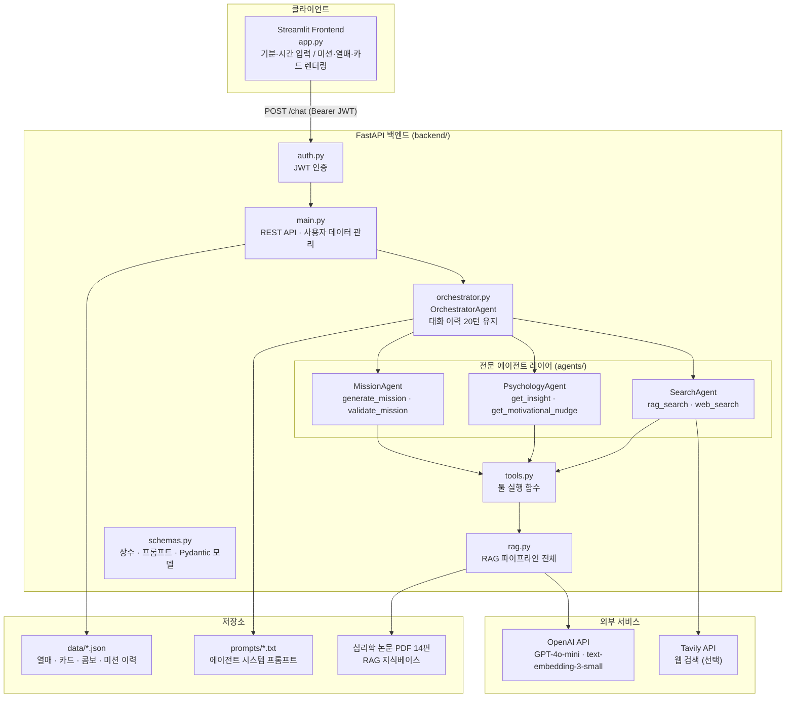
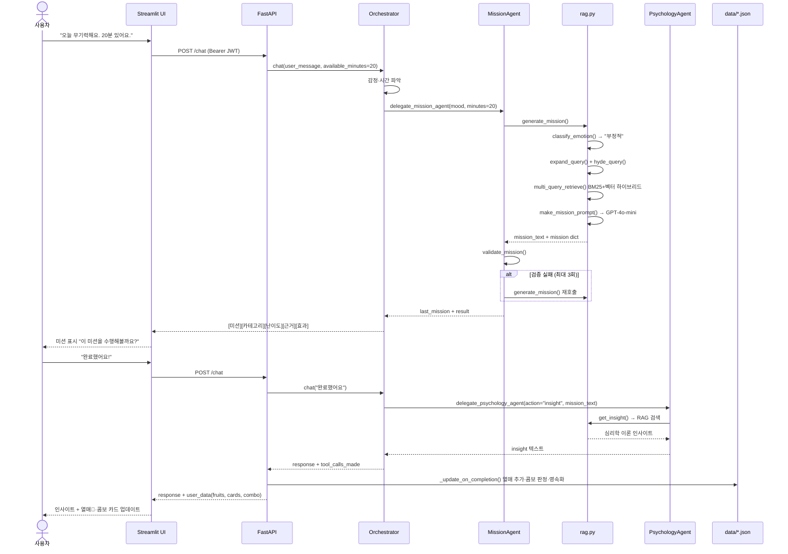
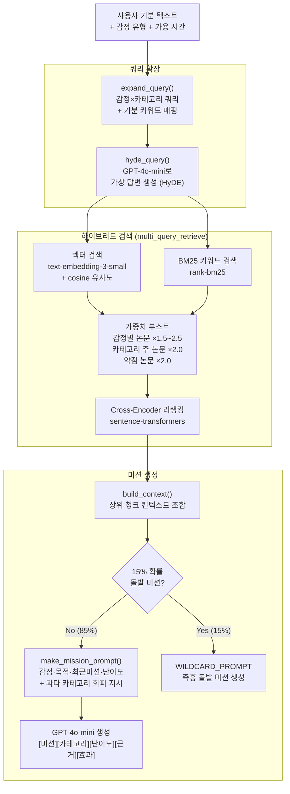
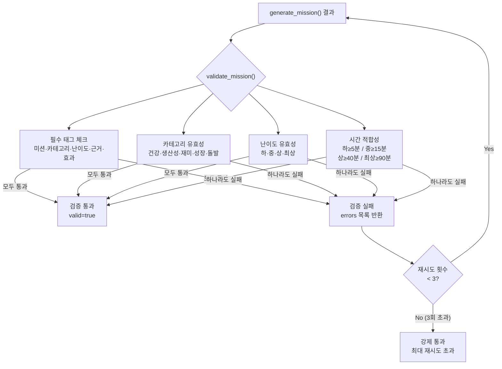

# Bloom — 심리학 기반 일일 미션 생성 AI · 프로젝트 결과보고서

PBL(Problem-Based Learning) 방식으로 실제 일상의 문제를 발견하고, 멀티에이전트 AI 파이프라인으로 해결한 프로젝트입니다.

---

## 목차

1. 문제 정의
2. 해결 방향
3. 트레이드오프 및 설계 결정
4. 시스템 아키텍처
5. 에이전트 파이프라인
6. 프로젝트 진화 경로
7. 기술 스택
8. 평가 결과
9. 실행 방법

---

## 1. 문제 정의

### 배경

운동·독서·명상 같은 일상 미션 앱들은 사용자가 실제로 미션을 지속하지 못하는 문제를 해결하지 못하고 있습니다. 현장에서 반복적으로 발생하는 세 가지 핵심 문제를 확인했습니다.

| # | 문제 | 구체적 증상 |
|---|---|---|
| 1 | **감정 무시 미션** | 우울하거나 무기력한 날에도 동일한 강도의 미션이 제시됨. 절반은 "너무 어렵다"며 포기, 나머지는 "의미 없다"며 이탈 |
| 2 | **과학적 근거 부재** | 미션이 심리학 이론과 무관하게 생성됨. 사용자가 "왜 이 미션이 도움되는지" 이해하지 못해 지속 동기 낮음 |
| 3 | **완료 후 단절** | 미션 완료 후 아무런 심리학 인사이트나 후속 격려 없이 대화 종료. 성취감과 학습이 연결되지 않음 |

### 핵심 질문

> "사용자의 현재 감정과 가용 시간을 파악하여, 심리학 논문에 근거한 맞춤 미션을 자동으로 생성하고 완료 후 인사이트까지 제공할 수 있는가?"

---

## 2. 해결 방향

### 감정 분류 기반 미션 매칭

사용자의 기분 텍스트를 5가지 감정 유형(부정적·중립·긍정적·집중됨·지루함)으로 분류하고, 각 감정에 맞는 심리학 개입법(CBT, 행동 활성화, Flow 이론 등)을 검색하여 미션을 생성합니다.

| 감정 유형 | 미션 목적 | 주요 논문 근거 |
|---|---|---|
| 부정적 | 기분전환·회복 | CBT, 행동 활성화, 자기연민 |
| 중립 | 생산성·성장 | 행동 활성화, 자기결정이론 |
| 긍정적 | 도전·재미·확장 | 긍정 정서 확장, Flow 이론 |
| 집중됨 | 딥워크·몰입 | Flow 이론, 자기결정이론 |
| 지루함 | 자극·탐험 | 행동 활성화, 긍정 심리학 |

### 멀티에이전트 파이프라인

단일 LLM 호출로 모든 것을 처리하지 않고, 역할이 명확히 분리된 4개 전문 에이전트가 협력합니다.

```
Orchestrator (Bloom)
  ├── delegate_mission_agent    → MissionAgent (생성 + 검증)
  ├── delegate_psychology_agent → PsychologyAgent (인사이트 + 격려)
  └── delegate_search_agent     → SearchAgent (RAG + 웹 검색)
```

### 이중 검증 + 보상 시스템

생성된 미션을 규칙 기반(태그·시간·카테고리·난이도)과 완료 후 인사이트로 이중 보완합니다. 미션 완료 시 열매(🌱🌿🌟🏆)와 콤보 카드가 쌓이는 보상 구조로 지속 동기를 설계합니다.

---

## 3. 트레이드오프 및 설계 결정

### 3-1. 멀티에이전트 vs. 단일 LLM 호출

| 항목 | 단일 LLM | 멀티에이전트 (채택) |
|---|---|---|
| 응답 속도 | 빠름 (1회 호출) | 느림 (3~4회 호출) |
| 구현 복잡도 | 낮음 | 높음 |
| 역할 분리 | 없음 | 명확 (생성/검증/심리/검색 분리) |
| 재시도 유연성 | 전체 재생성 | 검증 실패 시 생성만 선택적 재시도 |
| 미션 품질 | 프롬프트 1개로 모든 제약 처리 | 각 에이전트가 전문 정보만 처리 |

**채택 이유**: 미션 품질이 핵심 요구사항이었기 때문에 속도보다 정확도 우선. 검증 실패 시 RAG를 재실행하지 않고 생성-검증 루프만 반복(최대 3회)하여 API 비용 최소화.

### 3-2. HyDE + 하이브리드 검색 vs. 단순 벡터 검색

| 항목 | 단순 벡터 | HyDE + 하이브리드 (채택) |
|---|---|---|
| 단어 정확도 | 낮음 (의미 기반만) | 높음 (BM25 보완) |
| 희귀 키워드 | 취약 | 강함 |
| 구현 비용 | 낮음 | 중간 |
| 검색 품질 | Precision@k ≈ 0.6~0.7 | Precision@k = 1.000 |

**채택 이유**: 14개 심리학 논문의 전문 용어(예: "행동 활성화", "Flow 상태")는 의미 유사도만으로 검색하면 누락됩니다. BM25 키워드 검색 + 벡터 검색 하이브리드로 검색 정확도를 최대화했습니다.

### 3-3. 규칙 기반 검증 vs. LLM 전용 검증

| 항목 | LLM 전용 검증 | 규칙 + LLM 혼합 (채택) |
|---|---|---|
| 구현 비용 | 낮음 | 중간 |
| 결정론적 보장 | 없음 (확률적) | 있음 (정규식 항목) |
| 비용 | 높음 | 낮음 (LLM 호출 최소화) |
| 검증 항목 | 모호할 수 있음 | 태그 존재·시간 적합성은 코드로 확정 |

**채택 이유**: "[미션] 태그가 존재하는가", "난이도별 최소 시간을 충족하는가" 같은 항목은 정규식으로 확실히 판단 가능합니다. LLM은 이 검증에 쓰이지 않고 인사이트 생성에만 집중합니다.

### 3-4. 프롬프트 외부화 vs. 코드 내 하드코딩

**채택**: `prompts/` 폴더 `.txt` 파일 방식

**이유**: 프롬프트는 코드보다 훨씬 자주 수정됩니다. 코드 배포 없이 프롬프트만 교체하여 품질을 빠르게 개선할 수 있습니다. `orchestrator.txt`, `mission_agent.txt`, `psychology_agent.txt`, `search_agent.txt`를 코드와 분리하면 도메인 전문가가 직접 수정할 수 있습니다.

### 3-5. 열매·카드 보상 시스템 vs. 단순 응답

**채택**: 미션 완료 시 열매 + 콤보 카드 누적

| 보상 요소 | 설명 |
|---|---|
| 열매 (Fruit) | 완료 미션마다 누적 (최대 30개), 난이도·카테고리별 구분 |
| 2연속 콤보 카드 | 같은 카테고리 2회 연속 완료 시 카테고리별 전용 카드 지급 |
| 3연속 골드 카드 | 3회 연속 완료 시 골드 카드 지급 |
| 돌발 미션 (15%) | 무작위 확률로 즉흥 미션 등장, 지루함 방지 |

**이유**: 단순 대화 응답으로는 재방문 동기가 없습니다. 누적 보상 구조가 지속적인 미션 수행 행동을 강화합니다(행동 활성화 이론 적용).

---

## 4. 시스템 아키텍처

### 계층 도식



### 계층 설명

| 계층 | 역할 |
|---|---|
| Streamlit UI | 기분·시간 입력, 미션 결과 표시, 열매·카드 현황판 렌더링 |
| FastAPI | JWT 인증, REST API (`/auth`, `/health`, `/chat`) |
| Orchestrator | 에이전트 순서 제어, 위임 도구 관리, 대화 이력 유지 (최근 20턴) |
| Agent Layer | 각 에이전트 단일 책임 — BaseSpecialistAgent 상속, ReAct 서브루프 |
| RAG Layer | 14개 심리학 논문 PDF → 청크 분할 → 임베딩 + BM25 인덱스 |
| Storage | 사용자별 JSON 파일 (열매·카드·콤보·미션 이력 영속화) |

### 디렉터리 구조

```
08.MultiAgent/
├── backend/
│   ├── main.py            # FastAPI 엔드포인트
│   ├── orchestrator.py    # OrchestratorAgent
│   ├── agents/
│   │   ├── __init__.py        # BaseSpecialistAgent (공통 ReAct 루프)
│   │   ├── mission_agent.py   # 미션 생성·검증
│   │   ├── psychology_agent.py # 인사이트·격려
│   │   └── search_agent.py    # RAG·웹 검색
│   ├── tools.py           # 툴 실행 함수
│   ├── rag.py             # RAG 파이프라인 전체
│   ├── schemas.py         # 상수·프롬프트·Pydantic 모델
│   └── auth.py            # JWT 인증
├── frontend/
│   └── app.py             # Streamlit UI
├── prompts/               # 에이전트별 시스템 프롬프트 (.txt)
└── data/                  # 사용자 데이터 JSON 저장
```

---

## 5. 에이전트 파이프라인

### 전체 흐름 (미션 생성 → 완료 시나리오)



### 에이전트별 책임

| 에이전트 | 보유 툴 | 역할 |
|---|---|---|
| **OrchestratorAgent** | `delegate_mission_agent`<br>`delegate_psychology_agent`<br>`delegate_search_agent` | 대화 흐름 제어, 감정·시간 파악, 전문 에이전트 위임 |
| **MissionAgent** | `generate_mission`<br>`validate_mission` | 전체 RAG 파이프라인 실행 후 미션 생성, 형식·시간·카테고리 검증 |
| **PsychologyAgent** | `get_insight`<br>`get_motivational_nudge` | 완료 미션의 심리학 이론 해설, 거절 시 동기면담 격려 |
| **SearchAgent** | `rag_search`<br>`web_search` | 추가 심리학 근거 검색, Tavily 웹 검색 보완 |

### RAG 파이프라인 세부



### 검증 구조



---

## 6. 프로젝트 진화 경로

이 프로젝트는 단계적으로 기능을 확장하며 구현했습니다.

```
03 기본 챗봇  →  04 RAG  →  05 Advanced RAG  →  06 Evaluation  →  07 SingleAgent  →  08 MultiAgent
단일 LLM          PDF 임베딩    하이브리드 검색       평가 파이프라인     Tool Calling        역할 분리 에이전트
```

| 단계 | 핵심 추가 기능 |
|---|---|
| **03** | GPT-4o 단일 호출, Rich CLI 터미널 UI |
| **04** | 심리학 논문 PDF → 벡터 임베딩, 감정별 맞춤 미션 설계 |
| **05** | BM25 + 벡터 하이브리드 검색, HyDE 쿼리 확장, 멀티쿼리, Cross-Encoder 리랭킹 |
| **06** | RAG 평가 파이프라인 (Retrieval·Faithfulness·Requirement Coverage·Rule-based) |
| **07** | OpenAI Tool Calling 기반 ReAct 에이전트, 스트리밍 UI |
| **08** | 역할 분리 3-전문 에이전트, 이중 검증 루프, JWT 인증, 열매·카드 보상, analyze_coverage |

### 05 → 08 핵심 이식 기능

05.Advanced_RAG에서 구현된 검색 고도화 기능이 08.MultiAgent에 전부 이식되었습니다.

| 기능 | 05 위치 | 08 위치 |
|---|---|---|
| HyDE 쿼리 확장 | `rag.py` | `rag.py::hyde_query()` |
| 멀티쿼리 하이브리드 검색 | `rag.py` | `rag.py::multi_query_retrieve()` |
| Cross-Encoder 리랭킹 | `rag.py` | `rag.py` (sentence-transformers) |
| 감정별 논문 가중치 | `schemas.py` | `schemas.py::EMOTION_SOURCE_WEIGHT` |
| 약점 논문 부스트 | — | `rag.py::analyze_coverage()` (신규) |
| 카테고리 과다 사용 방지 | — | `rag.py::get_mission()` 과다 감지 (신규) |

---

## 7. 기술 스택

| 분류 | 기술 | 용도 |
|---|---|---|
| LLM | GPT-4o-mini (OpenAI) | 감정 분류, 미션 생성, 인사이트, 격려 |
| Embedding | text-embedding-3-small | 심리학 논문 청크 벡터화 |
| 하이브리드 검색 | rank-bm25 + numpy (코사인 유사도) | BM25 + 벡터 혼합 검색 |
| 리랭킹 | sentence-transformers (Cross-Encoder) | 최종 청크 순위 재조정 |
| 지식베이스 | 14개 심리학 논문 PDF (로컬 파일) | RAG 인덱스 소스 |
| 웹 검색 | Tavily API | 최신 정보 보완 (선택) |
| 백엔드 | FastAPI + Uvicorn | REST API |
| 인증 | python-jose (JWT) | Bearer 토큰 인증 |
| 프론트엔드 | Streamlit | 기분 입력 UI, 미션·열매·카드 렌더링 |
| 스키마 | Pydantic v2 | 요청/응답 타입 보장 |
| 영속화 | 사용자별 JSON 파일 | 열매·카드·콤보·미션 이력 저장 |

### 심리학 논문 지식베이스 (14편)

| 논문 라벨 | 관련 영역 |
|---|---|
| CBT(인지행동치료) | 인지 재구조화, 행동 변화 |
| 행동 활성화 1, 2 | 저활력·우울 상태 행동 개입 |
| 마음챙김 | 스트레스 반응 조절 |
| 감정 조절 전략 | Gross 과정 모델 |
| 긍정 심리학 | Seligman PERMA 모델 |
| 자기결정이론 | 내재적 동기, 자율성 |
| 긍정 정서 확장 | Fredrickson 확장-구축 이론 |
| 자기연민 | 심리치료 내 자기연민 역할 |
| 사회적 고립·우울 | 고립이 우울·불안에 미치는 영향 |
| 수면·감정조절 | 수면과 감정 조절의 관계 |
| 운동·정신건강 | 운동이 우울증에 미치는 효과 |
| Flow 이론 | 몰입 경험, 도전-역량 균형 |
| 동기면담 | 변화 동기 강화 대화 기법 |

---

## 8. 평가 결과

06.Evaluation 모듈로 5개 케이스에 대한 자동 평가를 수행했습니다.

### 요약 점수 (평가일: 2026-04-28)

| 평가 항목 | 평균 점수 | Pass Rate | 설명 |
|---|:---:|:---:|---|
| Retrieval (Precision@k) | **1.000** | 100% | 감정별 관련 논문 상위 검색 정확도 |
| Faithfulness | **0.320** | 20% | 미션 [근거]·[효과]의 컨텍스트 일치 |
| Requirement Coverage | **1.000** | 100% | 형식 태그·카테고리·감정 일치 등 |
| Rule-based | **0.971** | 100% | 시간·카테고리 비율·콤보 규칙 |

### 케이스별 결과

| 케이스 | 감정 | 생성 미션 | Faithfulness | Rule-based |
|---|---|---|:---:|:---:|
| case_001 | 부정적 | 10분간 가벼운 스트레칭 하기 | 0.200 | 1.000 ✅ |
| case_002 | 긍정적 | 무료 온라인 강의 찾아보기 | 0.000 | 1.000 ✅ |
| case_003 | 집중됨 | 45분간 책 한 챕터 읽기 | 0.200 | 1.000 ✅ |
| case_004 | 지루함 | 나비처럼 춤추기 (돌발) | 1.000 ✅ | 1.000 ✅ |
| case_005 | 중립 | 20분 운동 루틴 진행하기 | 0.200 | 0.857 ❌ |

### 평가 기반 개선 사항

Faithfulness 0.320 및 case_005 category_balance 실패를 분석하여 다음 개선을 적용했습니다.

| 문제 | 원인 | 개선 |
|---|---|---|
| Faithfulness 낮음 | [근거]·[효과] 필드가 추상적 — 검증 가능한 클레임 부족 | `make_mission_prompt()`에 이론명 명시 + 논문 수치 포함 규칙 2줄 추가 |
| category_balance 실패 | 과거 열매에 생산성 카테고리 집중, LLM이 같은 카테고리 선택 | `get_mission()`에 과다 카테고리 감지(50% 초과) → 다른 카테고리 선택 지시 추가 |
| Retrieval 스킵 | `relevant_doc_ids` 전부 빈 배열 | testset 5개 케이스에 감정별 기대 논문 라벨 채워 실측 평가 활성화 |

---

## 9. 실행 방법

### 환경 설정

```bash
# 08.MultiAgent/.env
OPENAI_API_KEY=sk-...
TAVILY_API_KEY=tvly-...        # 선택 (없으면 웹 검색 스킵)
JWT_SECRET_KEY=your-secret-key
```

### 백엔드 실행

```bash
cd 08.MultiAgent
pip install -r backend/requirements.txt
python -m uvicorn backend.main:app --reload --port 8000
# http://localhost:8000
```

### 프론트엔드 실행

```bash
cd 08.MultiAgent/frontend
pip install -r requirements.txt
streamlit run app.py
# http://localhost:8501
```

### API 직접 사용

```bash
# 1. 로그인 → JWT 발급
TOKEN=$(curl -s -X POST http://localhost:8000/auth/login \
  -H "Content-Type: application/json" \
  -d '{"username":"admin","password":"admin"}' | python -c "import sys,json; print(json.load(sys.stdin)['access_token'])")

# 2. 미션 생성 요청
curl -X POST http://localhost:8000/chat \
  -H "Authorization: Bearer $TOKEN" \
  -H "Content-Type: application/json" \
  -d '{
    "message": "오늘 너무 무기력해요",
    "available_minutes": 20
  }'
```

### API 엔드포인트 목록

| Method | Path | 설명 |
|---|---|---|
| POST | `/auth/login` | 로그인 → JWT 발급 |
| GET | `/auth/verify` | 토큰 유효성 확인 |
| GET | `/health` | 서버 상태 + RAG 인덱스 로드 여부 |
| POST | `/chat` | 오케스트레이터 대화 (단일 엔드포인트) |

---

## 라이선스

MIT
